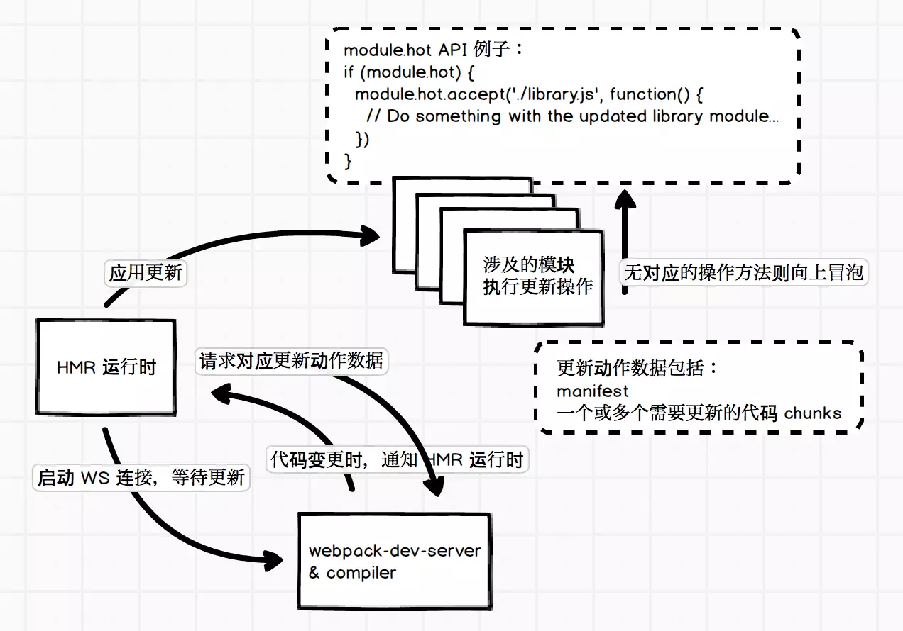

# webpack-hmr

## Hot Module Replacement(hmr)
在 HMR(模块热替换) 这个概念出现之前, 有 Hot Reloading(即当代码变更时通知浏览器刷新页面, 以避免频繁手动刷新浏览器页面). HMR 可以理解为增强版的 Hot Reloading, 但不用整个页面刷新, 而是局部替换掉部分模块代码并且使其生效

### 配置使用 HMR
在安装好 webpack-dev-server 的前提下, 配置两个启用 HMR 的插件即可:
```js
const webpack = require('webpack')

module.exports = {
  // ...
  devServer: {
    hot: true // dev server 的配置要启动 hot, 或者在命令行中带参数开启
  },
  plugins: [
    // ...
    new webpack.NamedModulesPlugin(), // 用于启动 HMR 时可以显示模块的相对路径
    new webpack.HotModuleReplacementPlugin(), // Hot Module Replacement 的插件
  ]
}
```

### HMR 原理
首先我们需要知道一个概念: webpack 内部运行时, 会维护一根用于管理构建代码时各个模块之间交互的表数据 --- Manifest, 其中包括入口代码文件和构建生成的 bundle 文件的对应关系, 通过 WebpackManifestPlugin 插件就可以输出这样一份数据

当有更新时, webpack-dev-server 发送更新信号给 HMR 运行时, 然后 HMR 再请求所需要的更新数据, 请求的更新数据没有问题的话就应用更新.


HMR 运行时代码会提供定义代码模块应用更新时执行的 API, 这些 API 可以让我们在模块中定义接收到 HMR 更新应用信号时, 需要额外做什么工作. 例如,  style-loader 就需要实现 HMR 接口, 当收到更新时, 使用新的样式替换掉旧的样式, 大概是这样:
```js
if (module.hot) {
  module.hot.accept('/some/path', function() {
    // ... 用新样式替换旧样式
  })
}
```
详见 [style-loader 中的代码实现](https://github.com/webpack-contrib/style-loader/blob/master/index.js#L36)

HMR 应用更新时是使用 webpackHotUpdate 来处理的:
```js
webpackHotUpdate(id, {
  'modulePath': function() {
    // 模块更新后的代码
  }
})
```
执行 webpackHotUpdate 时如发现模块代码实现了 HMR 接口, 就会执行相应的回调或者方法从而达到应用更新时, 模块可以自行管理自己所需要额外做的工作. 不过, 并不是所有的模块都需要做相关的处理, 当遇见没有实现 HMR 接口的模块时, 就会往上层冒泡.

### module.hot 的常见 API
- module.hot.accept: 指定在应用特定代码模块更新时执行相应的 callback
- module.hot.decline: 对于指定的代码模块, 拒绝进行模块代码的更新, 进入更新失败状态
- module.hot.dispose: 添加一个处理函数, 在当前模块代码被替换时运行该函数
- module.hot.removeDisposeHandler: 移除 dispose 方法添加的 callback
