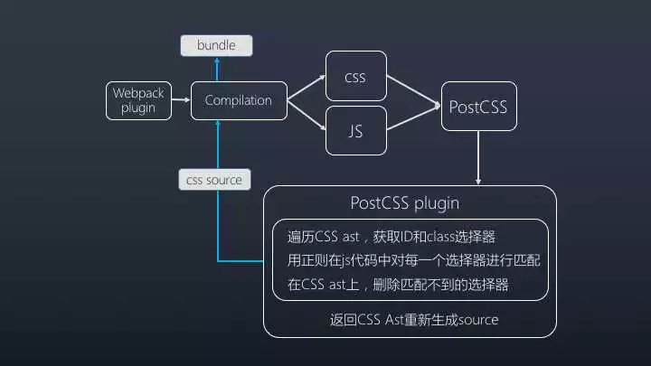

# Tree shaking

## tree-shaking 的原理
Tree-shaking 的本质是消除无用的 js 代码, 无用代码消除在广泛存在于传统的编程语言编译器中, 编译器可以判断出某些代码根本不影响输出, 然后消除这些代码, 这个称之为 DCE(dead code elimination)

Tree-shaking 和传统的 DCE 的方法又不太一样, 传统的 DCE 消灭不可能执行的代码, 而 Tree-shaking 更关注于消除没有用到的代码. 下面详细介绍一下 DCE 和 Tree-shaking.

### Dead Code Elimination
Dead Code 一般具有以下几个特征:
- 代码不会被执行, 不可到达
- 代码执行的结果不会被用到
- 代码只会影响死变量(只写不读)

传统编译型的语言中, 都是由编译器将 Dead Code 从 AST(抽象语法树) 中删除, 那 javascript 中是由谁做 DCE 呢?  ---
是著名的代码压缩优化工具 uglify, uglify 完成了 javascript 的 DCE.

### Tree shaking 代码消除
先思考一个问题, 为什么 tree-shaking 是最近几年流行起来了? 而前端模块化概念已经有很多年历史了, 其实 **tree-shaking 的消除原理是依赖于 ES6 的模块特性**.

ES6 module 特点:
- 只能作为模块顶层的语句出现
- import 的模块名只能是字符串常量
- import binding 是 immutable 的

ES6 模块依赖关系是确定的, 和运行时的状态无关, 可以进行可靠的静态分析, 这是 tree-shaking 的基础.

所谓静态分析就是不执行代码, 从字面量上对代码进行分析, ES6 之前的模块化, 比如我们可以动态 require 一个模块, 只有执行后才知道引用的什么模块, 这个就不能通过静态分析去做优化. 这是 ES6 modules 在设计时的一个重要考量, 也是为什么没有直接采用 CommonJS, 正是基于这个基础上, 才使得 tree-shaking 成为可能, 这也是为什么 rollup 和 webpack 2 都要用 ES6 module syntax 才能 tree-shaking.

- rollup 只处理函数和顶层的 import/export 变量, 不能把没用到的类的方法消除掉
- javascript 动态语言的特性使得静态分析比较困难
- 如果程序运行时就可能报错, 那就本末倒置了, 我们的目的是优化, 肯定不能影响执行

举个例子说明下为什么不能消除 menu.js:
```js
function Menu() {
}

Menu.prototype.show = function() {
}

Array.prototype.unique = function() {
    // 将 array 中的重复元素去除
}

export default Menu;
```
如果删除了 menu.js, 那对 Array 的扩展也会被删除, 就会影响功能. 那也许你会问, 难道 rollup, webpack 不能区分是定义 Menu 的 proptotype 还是定义 Array 的 proptotype 吗? 当然如果代码写成上面这种形式是可以区分的, 如果我写成这样呢?

```js
function Menu() {
}

Menu.prototype.show = function() {
}

var a = 'Arr' + 'ay'
var b

if(a == 'Array') {
    b = Array
} else {
    b = Menu
}

b.prototype.unique = function() {
    // 将 array 中的重复元素去除
}

export default Menu;
```

这种代码, 静态分析是分析不了的, 就算能静态分析代码, 想要正确完全的分析也比较困难.

rollup 和 webpack 表现不理想, 那该怎么办? --- Google 的 closure compiler 是可以解决这样的问题的

但是不能高兴得太早, 能得到这么完美结果是需要条件的, 那就是 cc 的侵入式约束规范. 必须在代码里添加注解. google 定义一整套注解规范 Annotating JavaScript for the Closure Compiler, 想更多了解的, 可以去看下官网.

侵入式这个就让人很不爽, google Closure Compiler 是 java 写的, 和我们基于 node 的各种构建库不可能兼容(不过目前好像已经有 nodejs 版 Closure Compiler), Closure Compiler 使用起来也比较麻烦, 所以虽然效果很赞, 但比较难以应用到项目中, 迁移成本较大.

最后总结一下
- ES6 的模块引入是静态分析的, 故而可以在编译时正确判断到底加载了什么代码.
- 分析程序流, 判断哪些变量未被使用、引用, 进而删除此代码.

很好, 原理非常完美, 那为什么我们的代码又删不掉呢? --- 因为**副作用**

## 副作用
比如这个函数:
```js
function go (url) {
  window.location.href = url
}
```
这个函数修改了全局变量 location, 甚至还让浏览器发生了跳转, 这就是一个有副作用的函数.

### 成也 babel, 败页 babel
因为它的编译, 一些我们原本看似没有副作用的代码, 便转化为了(可能)有副作用的. 例如 class 这样的 ES6 语法, 编译后是会产生副作用的, 因为实际会通过 Object.defineProperty 来实现(为了实现符合 ES6 的语义)[babel 有一个 loose 模式, 会不严格的遵循 ES6 的语义]

### 不够屌的 UglifyJS
不要开心的太早, 当使用 webpack —— uglifyjs 打包文件时, 又会被打包进去, 因为变量赋值是有可能产生副作用的:
```js
var V8Engine = (function () {
  function V8Engine () {}
  V8Engine.prototype.toString = function () { return 'V8' }
  return V8Engine
}())

var V6Engine = (function () {
  function V6Engine () {}
  V6Engine.prototype = V8Engine.prototype // <---- side effect
  V6Engine.prototype.toString = function () { return 'V6' }
  return V6Engine
}())

console.log(new V8Engine().toString())
```

V6Engine 虽然没有被使用, 但是它修改了 V8Engine 原型链上的属性, 这就产生副作用了. rollup 目前就是这样的策略, 直接把 V6Engine 给删了, 其实是不对的.

现在有一个提案, 可以在代码上通过 /\*@__PURE__\*/ 这样的注释声明此函数无副作用.

总结下几点关键信息:
- 函数的参数若是引用类型, 对于它属性的操作, 都是有可能会产生副作用的. 因为首先它是引用类型, 对它属性的任何修改其实都是改变了函数外部的数据. 其次获取或修改它的属性, 会触发 getter 或者 setter, 而 getter、setter 是不透明的, 有可能会产生副作用.
- uglify 没有完善的程序流分析. 它可以简单的判断变量后续是否被引用、修改, 但是不能判断一个变量完整的修改过程, 不知道它是否已经指向了外部变量, 所以很多有可能会产生副作用的代码, 都只能保守的不删除.
- rollup 有程序流分析的功能, 可以更好的判断代码是否真正会产生副作用

### 到底怎么办?
**假如你把所有的资源文件通过 webpack 打包到一个 bundle 文件里的话, 那这个库文件从此与 Tree-shaking 无缘. **

目前业界流行的组件库多是将每一个组件或者功能函数, 都打包成单独的文件或目录. 然后可以像如下的方式引入:
```js
import clone from 'lodash/clone'

import Button from 'antd/lib/button';
```

但是这样呢也比较麻烦, 而且不能同时引入多个组件. 所以这些比较流行的组件库大哥如 antd, element 专门开发了 babel 插件, 使得用户能以 import { Button, Message } form 'antd' 这样的方式去按需加载. 本质上就是通过插件将上一句的代码又转化成如下:
```js
import Button from 'antd/lib/button';
import Message from 'antd/lib/button';
```

这样似乎是最完美的变相 tree-shaking 方案. 唯一不足的是, 对于组件库开发者来说, 需要专门开发一个 babel 插件；对于使用者来说, 需要引入一个 babel 插件, 稍微略增加了开发成本与使用成本.

除此之外, 其实还有一个比较前沿的方法. 是 rollup 的一个提案, 在 package.json 中增加一个 key: module, 如下所示:

```js
{
  "name": "my-package",
  "main": "dist/my-package.umd.js",
  "module": "dist/my-package.esm.js"
}
```
这样, 当开发者以es6模块的方式去加载 npm 包时, 会以 module 的值为入口文件, 这样就能够同时兼容多种引入方式, (rollup 以及 webpack2+ 都已支持). 但是 webpack 不支持导出为 es6 模块, 所以 webpack 还是要拜拜. 我们得上 rollup!

### 使用 rollup 打包 JavaScript 库
吃了那么多亏后, 我们终于明白, 打包工具库、组件库, 还是 rollup 好用, 为什么呢?
- 它支持导出 ES 模块的包.
- 它支持程序流分析, 能更加正确的判断项目本身的代码是否有副作用.
- 我们只要通过 rollup 打出两份文件, 一份 umd 版, 一份 ES 模块版, 它们的路径分别设为 main, module 的值. 这样就能方便使用者进行 tree-shaking.

那么问题又来了, 使用者并不是用 rollup 打包自己的工程化项目的, 由于生态不足以及代码拆分等功能限制, 一般还是用 webpack 做工程化打包.

### 使用webpack打包工程化项目
之前也提到了, 我们可以先进行 tree-shaking, 再进行编译, 减少编译带来的副作用, 从而增加 tree-shaking 的效果. 那么具体应该怎么做呢?

首先我们需要去掉 babel-loader, 然后 webpack 打包结束后, 再执行 babel 编译文件. 但是由于 webpack 项目常有多入口文件或者代码拆分等需求, 我们又需要写一个配置文件, 对应执行 babel, 这又略显麻烦. 所以我们可以使用 webpack 的 plugin, 让这个环节依旧跑在 webpack 的打包流程中, 就像 uglifyjs-webpack-plugin 一样, 不再是以 loader 的形式对单个资源文件进行操作, 而是在打包最后的环节进行编译. 这里可能需要大家了解下 webpack 的 plugin 机制.

关于 uglifyjs-webpack-plugin, 这里有一个小细节, webpack 默认会带一个低版本的, 可以直接用 webpack.optimize.UglifyJsPlugin 别名去使用. 具体可以看 webpack 的相关说明

而这个低版本的 uglifyjs-webpack-plugin 使用的依赖 uglifyjs 也是低版本的, 它没有 uglifyES6 代码的能力, 故而如果我们有这样的需求, 需要在工程中重新 npm install uglifyjs-webpack-plugin -D, 安装最新版本的 uglifyjs-webpack-plugin, 重新引入它并使用.

这样之后, 我们再使用 webpack 的 babel 插件进行编译代码.

问题又来了, 这样的需求比较少, 因此 webpack 和 babel 官方都没有这样的插件, 只有一个第三方开发者开发了一个插件 babel-webpack-plugin. 可惜的是这位作者已经近一年没有维护这个插件了, 并且存在着一个问题, 此插件不会用项目根目录下的 .babelrc 文件进行 babel 编译. 有人对此提了 issue, 却也没有任何回应.

那么又没有办法, 就我来写一个新的插件吧 --- webpack-babel-plugin, 有了它之后我们就能让 webpack 在最后打包文件之前进行 babel 编译代码了, 具体如何安装使用可以点开项目查看. 注意这个配置需要在uglifyjs-webpack-plugin 之后, 像这样:
```js
plugins: [
  new UglifyJsPlugin(),
  new BabelPlugin()
]
```
但是这样呢, 有一个毛病, 由于 babel 在最后阶段去编译比较大的文件, 耗时比较长, 所以建议区分下开发模式与生产模式. 另外还有个更大的问题, webpack 本身采用的编译器 acorn 不支持对象的扩展运算符(...)以及某些还未正式成为 ES 标准的特性, 所以. . . . .

所以如果特性用的非常超前, 还是需要 babel-loader, 但是 babel-loader 要做专门的配置, 把还在 es stage 阶段的代码编译成 ES2017 的代码, 以便于 webpack 本身做处理.

还有一个插件 BabelMinifyWebpackPlugin, 它所依赖的 babel/minify 也集成了 uglifyjs. 使用此插件便等同于上述使用 UglifyJsPlugin + BabelPlugin 的效果, 如若有此方面需求, 建议使用此插件.

上面讲了这么多, 我最后再总结下, 在当下阶段, 在 tree-shaking 上能够尽力的事.
- 尽量不写带有副作用的代码. 诸如编写了立即执行函数, 在函数里又使用了外部变量等.
- 如果对 ES6 语义特性要求不是特别严格, 可以开启 babel 的 loose 模式, 这个要根据自身项目判断, 如: 是否真的要不可枚举 class 的属性.
如果是开发 JavaScript 库, 请使用 rollup. 并且提供 ES6 module 的版本, 入口文件地址设置到 package.json 的 module 字段.
- 如果 JavaScript 库开发中, 难以避免的产生各种副作用代码, 可以将功能函数或者组件, 打包成单独的文件或目录, 以便于用户可以通过目录去加载. 如有条件, 也可为自己的库开发单独的 webpack-loader, 便于用户按需加载.
- 如果是工程项目开发, 对于依赖的组件, 只能看组件提供者是否有对应上述 3、4 点的优化. 对于自身的代码, 除 1、2 两点外, 对于项目有极致要求的话, 可以先进行打包, 最终再进行编译.
- 如果对项目非常有把握, 可以通过 uglify 的一些编译配置, 如: pure_getters: true, 删除一些强制认为不会产生副作用的代码.

## Tree-Shaking性能优化实践 - 实践篇
优化还是要继续的, 虽然工具自带的 tree-shaking 不能去除太多无用代码, 在去除无用代码这一方面也还是有可以做的事情. 我们从三个方面做里一些优化.

### 对组件库引用的优化
当我们使用组件库的时候, import {Button} from 'element-ui', 相对于 Vue.use(elementUI), 已经是具有性能意识, 是比较推荐的做法, 但如果我们写成右边的形式, 具体到文件的引用, 打包之后的区别是非常大的, 以 antd 为例, 右边形式 bundle 体积减少约 80%.


这个引用也属于有副作用, webpack 不能把其他组件进行 tree-shaking. 既然工具本身是做不了, 那我们可以做工具把左边代码自动改成右边代码这种形式. 这个工具 antd 库本身也是提供的

### CSS Tree-shaking
我们前面所说的 tree-shaking 都是针对 js 文件, 通过静态分析, 尽可能消除无用的代码, 那对于 css 我们能做 tree-shaking 吗? 随着 CSS3, LESS, SASS 等各种 css 预处理语言的普及, css 文件在整个工程中占比是不可忽视的. 随着大项目功能的不停迭代, 导致 css 中可能就存在着无用的代码.

下面介绍一下原理整体思路是这样的, 遍历所有的 css 文件中的 selector 选择器, 然后去所有 js 代码中匹配, 如果选择器没有在代码出现过, 则认为该选择器是无用代码. 首先面临的问题是, 如何优雅的遍历所有的选择器呢? 难道要用正则表达式很苦逼的去匹配分割吗? babel 是 js 世界的福星, 其实 css世界也有利器, 那就是 postcss. postcss 提供了一个解析器, 它能够将 CSS 解析成 AST 抽象语法树. 然后我们能写各种插件, 对抽象语法树做处理, 最终生成新的 css 文件, 以达到对 css 进行精确修改的目的.


主要流程: 插件监听 webapck 编译完成事件, webpack 编译完成之后, 从 compilation 中找出所有的 css 文件和 js 文件
```js
apply (compiler) {
  compiler.plugin('after-emit', (compilation, callback) => {

    let styleFiles = Object.keys(compilation.assets).filter(asset => {
      return /\.css$/.test(asset)
    })

    let jsFiles = Object.keys(compilation.assets).filter(asset => {
      return /\.(js|jsx)$/.test(asset)
    })

    ....
  })
}
```

将所有的 css 文件送至 postcss 处理, 找出无用代码
```js
let tasks = []
styleFiles.forEach((filename) => {
  const source = compilation.assets[filename].source()

  let listOpts = {
    include: '',
    source: jsContents,  //传入全部js文件
    opts: this.options   //插件配置选项
  }

  tasks.push(postcss(treeShakingPlugin(listOpts)).process(source).then(result => {
    let css = result.toString()  // postcss处理后的css AST
    //替换webpack的编译产物compilation
    compilation.assets[filename] = {
      source: () => css,
      size: () => css.length
    }
    return result
  }))
})
```

postcss 遍历, 匹配, 删除过程
```js
module.exports = postcss.plugin('list-selectors', function (options) {
  // 从根节点开始遍历
  cssRoot.walkRules(function (rule) {
    // Ignore keyframes, which can log e.g. 10%, 20% as selectors
    if (rule.parent.type === 'atrule' && /keyframes/.test(rule.parent.name)) return

    // 对每一个规则进行处理
    checkRule(rule).then(result => {
      if (result.selectors.length === 0) {
        // 选择器全部被删除
        let log = ' ✂️ [' + rule.selector + '] shaked, [1]'
        console.log(log)
        if (config.remove) {
          rule.remove()
        }
      } else {
        // 选择器被部分删除
        let shaked = rule.selectors.filter(item => {
          return result.selectors.indexOf(item) === -1
        })
        if (shaked && shaked.length > 0) {
          let log = ' ✂️ [' + shaked.join(' ') + '] shaked, [2]'
          console.log(log)
        }
        if (config.remove) {
          // 修改AST抽象语法树
          rule.selectors = result.selectors
        }
      }
    })
  })
})
```

checkRule 处理每一个规则核心代码
```js
let checkRule = (rule) => {
  return new Promise(resolve => {
    ...
    let secs = rule.selectors.filter(function (selector) {
      let result = true
      let processor = parser(function (selectors) {
        for (let i = 0, len = selectors.nodes.length; i < len; i++) {
          let node = selectors.nodes[i]
          if (_.includes(['comment', 'combinator', 'pseudo'], node.type)) continue
          for (let j = 0, len2 = node.nodes.length; j < len2; j++) {
            let n = node.nodes[j]
            if (!notCache[n.value]) {
              switch (n.type) {
                case 'tag':
                  // nothing
                  break
                case 'id':
                case 'class':
                  if (!classInJs(n.value)) {
                    // 调用classInJs判断是否在JS中出现过
                    notCache[n.value] = true
                    result = false
                    break
                  }
                  break
                default:
                  // nothing
                  break
              }
            } else {
              result = false
              break
            }
          }
        }
      })
      ...
    })
    ...
  })
}
```

可以看到其实只处理了 id 选择器和 class 选择器, id 和 class 相对来说副作用小, 引起样式异常的可能性相对较小. 判断 css 是否再 js 中出现过, 是使用正则匹配. 其实, 后续还可以继续优化, 比如对 tag 类的选择器, 可以配置是否再 html, jsx, template 中出现过, 如果出现过, 没有出现过也可以认为是无用代码. 当然, 插件能正常工作还是的有一些前提和约束. 我们可以在代码中动态改变 css, 比如再 react 和 vue 中, 可以这么写这样是比较推荐的方式, 选择器作为字符或变量名出现在代码中, 下面这样动态生成选择器的情况就会导致匹配失败
```js
render(){
  this.stateClass = 'state-' + this.state == 2 ? 'open' : 'close'
  return <div class={this.stateClass}></div>
}
```

其中这样情况很容易避免
```js
render(){
  this.stateClass = this.state == 2 ? 'state-open' : 'state-close'
  return <div class={this.stateClass}></div>
}
```
所以有一个好的编码规范的约束, 插件能更好的工作.

### webpack bundle 文件去重
如果 webpack 打包后的 bundle 文件中存在着相同的模块, 也属于无用代码的一种. 也应该被去除掉首先我们需要一个能对 bundle 文件定性分析的工具, 能发现问题, 能看出优化效果.  webpack-bundle-analyzer 这个插件完全能满足我们的需求, 他能以图形化的方式展示 bundle 中所有的模块的构成的各构成的大小.

其次, 需求对通用模块进行提取, CommonsChunkPlugin 是最被人熟知的用于提供通用模块的插件. 早期的时候, 我并不完全了解他的功能, 并没有发挥最大的功效.

#### CommonsChunkPlugin 的正确用法
自动提取所有的 node_moudles 或者引用次数两次以上的模块.

minChunks 可以接受一个数值或者函数, 如果是函数, 可自定义打包规则但使用上面记载的配置之后, 并不能高枕无忧. 因为这个配置只能提取所有 entry 打包后的文件中的通用模块. 而现实是, 有了提高性能, 我们会按需加载, 通过 webpack 提供的 import(...) 方法, 这种按需加载的文件并不会存在于entry 之中, 所以按需加载的异步模块中的通用模块并没有提取.

如何提取按需加载的异步模块里的通用模块呢?

配置另一个 CommonsChunkPlugin, 添加 async 属性, async 可以接受布尔值或字符串. 当时字符串时, 默认是输出文件的名称. names 是所有异步模块的名称这里还涉及一个给异步模块命名的知识点. 我是这样做的:
```js
const Edit = resolve => { import( /* webpackChunkName: "EditPage" */ './pages/Edit/Edit').then((mod) => { resolve(mod.default); }) };

const PublishPage = resolve => { import( /* webpackChunkName: "Publish" */ './pages/Publish/Publish').then((mod) => { resolve(mod); }) };

const Models = resolve => { import( /* webpackChunkName: "Models" */ './pages/Models/Models').then((mod) => { resolve(mod.default); }) };

const MediaUpload = resolve => { import( /* webpackChunkName: "MediaUpload" */ './pages/Media/MediaUpload').then((mod) => { resolve(mod); }) };

const RealTime = resolve => { import( /* webpackChunkName: "RealTime" */ './pages/RealTime/RealTime').then((mod) => { resolve(mod.default); }) };
```

没错, 在 import 里添加注释. /* webpackChunkName: "EditPage" */ , 虽然看着不舒服, 但是管用.

思考一个问题: 不同 entry 模块或按需加载的异步模块需不需要提取通用模块?
- 这个需要看场景了, 比如模块都是在线加载的, 如果通用模块提取粒度过小, 会导致首页首屏需要的文件变多, 很多可能是首屏用不到的, 导致首屏过慢, 二级或三级页面加载会大幅提升.
- 所以这个就需要根据业务场景做权衡, 控制通用模块提取的粒度.
- 离线之后, 加载本地的js文件, 与网络无关, 基本上可以忽略文件大小, 所以更关注整个离线包的大小. 离线包越小, 耗费用户的流量就越小, 用户体验更好, 所以离线化的场景是非常适合最小粒提取通用模块的, 即将所有 entry 模块和异步加载模块的引用大于 2 的模块都提取, 这样能获得最小的输出文件, 最小的离线包.
